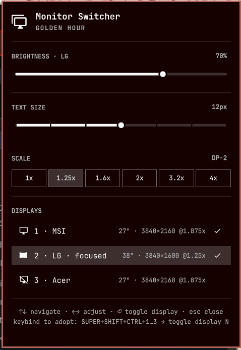
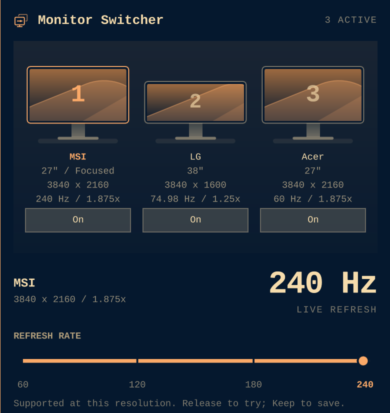

# Monitor Switcher

**Your displays, in one place. Settings that stay put.**

A keyboard-friendly display control center for [Omarchy](https://omarchy.org).
Turn monitors on and off directly from a visual gallery, see their actual
refresh rates, and adjust brightness, text size and scale without leaving the
panel. Monitor settings persist across Hyprland reloads and reboots.



*Actual panel capture: MSI 4K OLED at 240 Hz alongside LG and Acer displays.
Colors and typography follow the active Omarchy theme.*

The original [logo](logo.svg) is also used in the bar and panel header as a
theme-tinted vector. It is included with the plugin; it does not depend on a
font glyph or a marketplace-provided icon.

This is an **unofficial fork** of Omarchy's `omarchy.monitor` widget, originally
vendored from Omarchy 4.0.0 under MIT. It is not affiliated with or supported by
Omarchy. Please report plugin issues to
[this repository](https://github.com/amoltyagi/omarchy-monitor-switcher/issues).
See [UPSTREAM.md](UPSTREAM.md) for attribution and maintenance notes.

## Features

- **Monitor gallery:** proportioned screen illustrations, shortcut numbers,
  aliases, physical sizes, resolutions, scale and live Hz. On/Off buttons sit
  directly beneath each screen; there is no duplicate list to scroll to.
- **Persistent switching:** off states and per-monitor settings survive config
  reloads and reboots. The last active display cannot be switched off.
- **Supported refresh steps:** choose only rates advertised at the configured
  resolution, including fractional rates. A large readout shows the running mode.
- **20-second Keep/Revert trials:** refresh changes are verified against the
  compositor. An independent watchdog restores the previous configuration and
  generated layout if you do not confirm, even if the panel or shell closes.
- **Consistent sliders:** brightness, stepped text size and stepped scale share
  one visual language. Scale retains custom current values such as 187.5%.
- **No accidental wheel edits:** click, drag or use the keyboard to change a
  setting. Wheel gestures scroll the panel; scrolling the bar icon does nothing.
- **Keyboard-first controls:** arrow keys or `hjkl`, Enter/Space, and optional
  `SUPER+SHIFT+CTRL+1...N` monitor shortcuts. The shortcut hint stays in the footer.
- **Layout memory:** enabled screens pack in config order or use pinned
  positions. Overlapping layouts are rejected before they reach Hyprland.
- **One backend:** gallery actions, CLI commands and keybindings share the same
  persistent state and validation.

<details>
<summary>Gallery and 240 Hz refresh control, close up</summary>



</details>

## Install

Requires Omarchy 4.x with its Lua-based Hyprland configuration and Quickshell.
The backend uses Bash, jq, coreutils and util-linux tools supplied by Omarchy.

```bash
omarchy plugin add https://github.com/amoltyagi/omarchy-monitor-switcher --enable
omarchy plugin disable omarchy.monitor
```

The second command avoids duplicate display widgets; it only changes your bar
layout. Restore the built-in widget with `omarchy plugin enable omarchy.monitor`.
The two plugins have separate IPC targets, but the built-in widget's runtime-only
changes can conflict with this plugin's persisted settings.

On first use, the plugin adopts connected monitors and their current scale.
Refresh defaults to the monitor's **preferred** mode, which is not necessarily
its highest rate. Use the refresh slider to choose a higher supported rate.

## Use the Panel

Click the monitor icon in the bar to open the panel.

| Control | Behavior |
|---|---|
| Gallery On/Off | Persistently toggle that monitor; the last active screen is protected |
| Refresh rate | Drag to preview, release to try, then Keep within 20 seconds |
| Brightness | Adjust the focused monitor when brightness control is available |
| Text size | Adjust shell/GTK text size through Omarchy's text-size command |
| Scale | Preview a step and release to apply it to the focused monitor |
| Wheel/touchpad scroll | Scroll the panel without changing values |

The gallery identifies the focused screen. Refresh, brightness and scale target
that screen. The live Hz readout describes the compositor's display mode,
**not measured application FPS**. Refresh changes preserve resolution, scale,
position and rotation.

During a refresh trial, other layout changes are blocked. **Keep** saves the
choice; **Revert** restores the previous configuration immediately. Failed
rollback reloads are retried. If a watchdog is interrupted, the next backend
invocation recovers its expired trial.

### Keyboard Controls

| Key | Action |
|---|---|
| Up/Down or `k`/`j` | Move through gallery buttons and control sections |
| Left/Right or `h`/`l` | Walk buttons, adjust brightness/text size, or preview scale/refresh steps |
| Enter/Space | Toggle the highlighted monitor, apply a preview, or activate Keep/Revert |
| Escape | Close the panel; an unconfirmed refresh trial still reverts |
| Tab/Shift+Tab | Move between shell panels |

To toggle displays without opening the panel, add bindings to
`~/.config/hypr/bindings.lua`. Numbers follow **config order**, not connector names:

```lua
o.bind("SUPER + SHIFT + CTRL + 1", "Toggle display 1",
  os.getenv("HOME") .. "/.config/omarchy/plugins/case.monitor-switcher/bin/monitor-switcher toggle 1")
o.bind("SUPER + SHIFT + CTRL + 2", "Toggle display 2",
  os.getenv("HOME") .. "/.config/omarchy/plugins/case.monitor-switcher/bin/monitor-switcher toggle 2")
o.bind("SUPER + SHIFT + CTRL + 3", "Toggle display 3",
  os.getenv("HOME") .. "/.config/omarchy/plugins/case.monitor-switcher/bin/monitor-switcher toggle 3")
```

Descriptions also appear in Omarchy's `SUPER+K` keybindings sheet. Adjust the
plugin path if you installed it under a different ID.

## Command Line

The executable lives inside the plugin; installation does not add it to `PATH`.
Use its full path, or enable the short command for the current shell:

```bash
export PATH="$HOME/.config/omarchy/plugins/case.monitor-switcher/bin:$PATH"
```

Commands accept an output name (`DP-3`), case-insensitive alias (`MSI`), or
1-based config-order number (`1`):

```bash
monitor-switcher state                   # monitor table and overlap warnings
monitor-switcher state --json            # metadata, modes and pending trial
monitor-switcher toggle 1
monitor-switcher enable MSI
monitor-switcher disable DP-2
monitor-switcher scale MSI 1.875          # round to a Hyprland-compatible scale
monitor-switcher refresh MSI 240         # begin trial; prints confirmation token
monitor-switcher confirm <token>         # keep the trial mode
monitor-switcher revert <token>          # restore previous settings
monitor-switcher apply                   # apply the saved layout
```

Refresh requests must match an advertised rate, e.g. `74.98` rather than `75`
when the monitor advertises `74.98`. Only connected, active monitors can start
a refresh trial.

### Arrange Displays

```bash
monitor-switcher plan                    # compute layout without applying it
monitor-switcher move LG 2048x0          # pin an origin in logical pixels
monitor-switcher move LG above MSI       # left-of, right-of, above or below
monitor-switcher swap MSI LG             # swap pack-order entries; clear their pins
monitor-switcher pack                    # clear all pins; pack left-to-right
```

Geometry comes from configured resolution, scale and rotation, not a temporary
live fallback. `plan` does not apply a layout, but may update config metadata.
Use this plugin or another monitor-layout manager, not both: tools writing
rules for the same output can overwrite each other.

## Configuration

Edit `~/.config/monitor-switcher/config.json`, then run `monitor-switcher apply`.
Array order determines packing and shortcut numbers:

```json
[
  { "output": "DP-3", "alias": "MSI", "scale": 1.875, "mode": "3840x2160@240" },
  { "output": "DP-2", "alias": "LG", "scale": 1.25, "mode": "3840x1600@74.98" },
  { "output": "DP-1", "alias": "Acer", "scale": 1.875, "transform": 0 }
]
```

| Field | Default | Meaning |
|---|---|---|
| `output` | Required | Connector name from `hyprctl monitors all` |
| `alias` | Monitor model | Display name and optional CLI identifier |
| `scale` | Current scale | Per-monitor scale factor |
| `mode` | `preferred` | Hyprland mode, such as `3840x2160@240` |
| `transform` | `0` | Rotation/reflection; `1` is 90 degrees, `3` is 270 degrees |
| `position` | Automatic packing | Optional pinned origin, such as `2048x0` |
| `mode_w`, `mode_h` | Managed | Geometry snapshots for preferred mode; do not edit manually |

Keep a wildcard fallback in `~/.config/hypr/monitors.lua` for unmanaged outputs,
rather than competing explicit rules:

```lua
hl.monitor({ output = "", mode = "preferred", position = "auto", scale = 1 })
```

| State file | Purpose |
|---|---|
| `~/.config/monitor-switcher/config.json` | Monitor order and settings |
| `~/.local/state/monitor-switcher/state.json` | Disabled outputs |
| `~/.local/state/monitor-switcher/refresh-pending.json` | Temporary trial and rollback backup |
| `~/.local/state/omarchy/toggles/hypr/monitor-switcher.lua` | Generated rules sourced on reload |

File access is guarded and bounded; writes are staged and atomically renamed.
Layout commands are serialized. Refresh trials back up both config and generated
rules, validate reload results, and verify the active mode before confirmation.

## Update

For a regular Git-managed installation:

```bash
omarchy plugin update case.monitor-switcher
```

The updater shows the diff, fast-forwards after confirmation, and validates
locally. Marketplace verification is a separate exact-commit snapshot; it does
not pin an installed plugin to that commit.

Updating from a version that did not gate the generated file needs one layout
regeneration so the toggle file picks up the gate: run `monitor-switcher apply`
(or any toggle, move, scale, ...). Until then the old, ungated file keeps being
sourced, exactly as before.

Maintainers: bump `manifest.json`, update [CHANGELOG.md](CHANGELOG.md) and root
`preview.png`, then push. The marketplace's daily refresh can pick up new metadata
and previews. To verify the new snapshot, submit the
[Verify or update a listed plugin form](https://github.com/omacom/omarchy-plugin-marketplace/issues/new?template=verify-plugin.yml)
with the full new HEAD SHA and action **Verify and publish a newer upstream
commit**. Passing automation still requires marketplace-maintainer approval.
See the [marketplace update guide](https://github.com/omacom/omarchy-plugin-marketplace/blob/main/SUBMISSION.md#update-an-existing-listing).

## Development

For live development, link the repository into the user plugin directory:

```bash
ln -s ~/Work/omarchy-monitor-switcher ~/.config/omarchy/plugins/case.monitor-switcher
omarchy plugin validate ~/Work/omarchy-monitor-switcher
omarchy restart shell
```

Validate using the real repository path, not the installed symlink. Backend edits
apply on the next invocation. Restart the shell if QML changes do not appear.
Never modify packaged Omarchy files.

```bash
node --test tests/*.test.js
bash -n bin/monitor-switcher
```

Backend tests use temporary HOME directories and a fail-closed compositor stub,
not live displays. They cover mode selection, fractional rates, pending trials,
watchdog recovery, rollback, concurrency, unsafe paths and layout guards. Model
tests cover refresh matching, gallery proportions and exact scale stops.

Before shipping, inspect the live gallery and keyboard navigation, confirm that
scrolling cannot edit values, and check that toggles survive a reload. IPC state:
`omarchy-shell case.monitor-switcher state`. See [UPSTREAM.md](UPSTREAM.md) before
syncing changes from Omarchy's widget.

## Uninstall

Confirm or revert any pending refresh trial before removing the plugin. The
generated toggle file only applies while the plugin is installed and enabled, so
it goes inert as soon as the plugin is disabled or removed; the explicit `rm`
below just clears the leftover file.

```bash
omarchy plugin enable omarchy.monitor
omarchy plugin remove case.monitor-switcher
rm -f ~/.local/state/omarchy/toggles/hypr/monitor-switcher.lua
hyprctl reload
```

Restore any explicit monitor rules you need in `~/.config/hypr/monitors.lua`.

## License

MIT. See [LICENSE](LICENSE) for plugin code and
[LICENSE.upstream](LICENSE.upstream) for the Omarchy-derived widget code.
