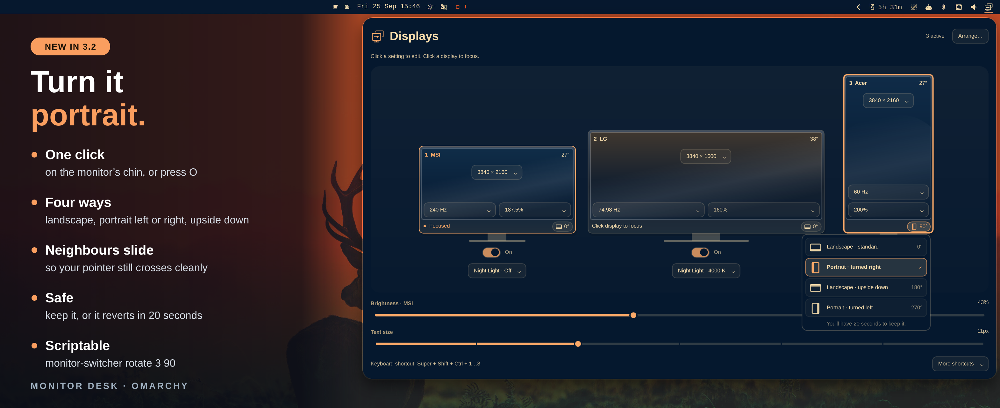

# Monitor Desk

## Your displays. One place.

Resolution, refresh rate, scale, **rotation**, power and layout for every
monitor, in one panel for [Omarchy](https://omarchy.org). Every change is a
verified before you keep it, and reverts by itself if you don't.

*Formerly **Monitor Switcher**. Same plugin ID (`case.monitor-switcher`),
commands, settings and shortcuts, so updating is seamless.*

**[Install](#install)** · **[Rotate a display](#rotate-a-display)** · [Use the panel](#use-the-panel) · [Keyboard](#keyboard-controls) · [Command line](#command-line) · [What's new in 3.2](RELEASE-NOTES.md)

<a href="preview.png"></a>

- **Click to edit.** Resolution, refresh and scale sit right on each display.
- **Turn it portrait.** *New in 3.2:* rotate from the button on each monitor's chin.
- **Drag to arrange.** Snap screens together to match your desk.
- **Try it first.** Display changes are verified and revert in 20 seconds unless you keep it.
- **Night Light per monitor.** Warm one screen and leave another in daylight.
- **Switch it on.** A power toggle under every monitor; the last one is protected.
- **Recover your desk.** Restore the last verified layout for the monitors you have plugged in.

Settings persist across reloads and reboots. Colors follow your theme.

## Portrait, in one click.

Click the small monitor button on a display's chin (or press `O`), pick an
orientation, and watch the card turn. Screens next to it slide over so your
pointer still crosses cleanly. Keep it, or do nothing and it reverts in 20 seconds.

<a href="preview-rotation.png"></a>

[How rotation works →](#rotate-a-display)

## A place for every display.

Drag portrait and landscape screens into position, or choose left, right,
above or below. Preview the layout, apply it, and keep it if it feels right.

<a href="preview-detail.png"></a>

## Night Light for each monitor.

Each monitor keeps its own saved temperature. Its menu opens directly from its
toggle, while the monitor details stay visible.
[See the Night Light menu →](assets/screenshots/night-light.png)

Full-size captures: [Main panel](assets/screenshots/displays.png) · [Rotation](assets/screenshots/rotation.png) · [Arrangement](assets/screenshots/arrangement.png) · [Night Light](assets/screenshots/night-light.png)

This is an **unofficial fork** of Omarchy's `omarchy.monitor` widget, originally
vendored from Omarchy 4.0.0 under MIT. It is not affiliated with or supported by
Omarchy. Please report plugin issues to
[this repository](https://github.com/amoltyagi/omarchy-monitor-switcher/issues).
See [UPSTREAM.md](UPSTREAM.md) for attribution and maintenance notes.

## Install

Requires Omarchy 4.x with its Lua-based Hyprland configuration and Quickshell.
The backend uses Bash, jq, coreutils and util-linux tools supplied by Omarchy.
Per-monitor Night Light also needs Python 3 and compositor support for
`wlr-gamma-control-v1` and `wl_output` version 4. No Python packages are required.

```bash
omarchy plugin add https://github.com/amoltyagi/omarchy-monitor-switcher --enable
omarchy plugin disable omarchy.monitor
```

The second command avoids duplicate display widgets; it only changes your bar
layout. Restore the built-in widget with `omarchy plugin enable omarchy.monitor`.
The two plugins have separate IPC targets, but the built-in widget's runtime-only
changes can conflict with this plugin's persisted settings.

On first use, the plugin adopts connected monitors and their current geometry
and scale. Preferred-mode entries resolve to an advertised mode matching that
geometry, preserving the running refresh rate when possible. Use the Hz chip to
choose a different advertised rate.

## Use the panel

Click the monitor icon in the bar to open the panel.

| Control | Behavior |
|---|---|
| Monitor screen | Focus that desktop; editing a setting never changes its target |
| On/Off switch | Persistently toggle that monitor; the last usable screen is protected |
| Rotation button (chin) | Choose landscape, portrait (either way) or upside down, then Keep within 20 seconds |
| Resolution / Hz / scale chip | Click, choose a supported value, then Keep within 20 seconds |
| Arrange… | Preview positions by dragging or using placement buttons, then Apply |
| Night Light | Open a menu anchored to its toggle (above when space is tight); choose Off or 2500–5000 K while monitor details remain visible |
| Restore working layout… | Under More shortcuts; preview the last verified layout for this connected monitor combination |
| Brightness | Adjust the focused monitor when brightness control is available |
| Text size | Adjust shell/GTK text size through Omarchy's text-size command |
| More shortcuts | Expand optional keyboard guidance; `?` also toggles it |
| Wheel/touchpad scroll | Scroll the panel without changing values |

The gallery fits the host screen in logical coordinates and wraps to fewer columns
when its controls would otherwise be crowded. Subtle casing and screen gradients
provide depth while preserving readable labels and focus borders.

When a disabled monitor returns to an occupied saved position in a horizontal
row, the switcher reopens its slot and shifts monitors to its right. For example,
after joining 1 and 3, enabling 2 restores the 1–2–3 row. For other arrangements,
it uses the nearest free adjoining edge. Failed changes restore the previous
configuration; explicit overlapping arrangement edits are still rejected.

Each chip targets its own monitor, even when another desktop has focus.
Brightness targets the focused monitor. Hz describes the compositor's display
mode, **not measured application FPS**. Off/modeless screens identify saved
settings explicitly instead of presenting them as live values.

During a display trial, other layout changes are blocked. **Keep** saves the
choice; **Revert** restores the previous configuration immediately. Failed
rollback reloads are retried. If a watchdog is interrupted, the next backend
invocation recovers its expired trial.

Confirmation state stays in sync across panels. Selecting the current value
does not start a trial, and focusing another monitor remains available. A normal
timeout or an already-finished preview is not shown as a red error.

### Keyboard Controls

| Key | Action |
|---|---|
| Up/Down or `k`/`j` | Select displays, controls or picker options |
| Left/Right or `h`/`l` | Walk selections or adjust brightness/text size |
| Enter/Space | Focus the selected display, choose an option, or activate Keep/Revert |
| `m` / `r` / `s` | Open resolution / refresh / scale for the selected display |
| `t` | Open Night Light for the selected display |
| `o` | Open rotation for the selected display |
| `p` | Toggle the selected display |
| `a` | Open/close Arrange |
| `?` | Expand/collapse More shortcuts |
| Escape | Close the picker, return from Arrange, then close the panel |
| Tab/Shift+Tab | Move between shell panels |

In Arrange, arrows place the selected display relative to the reference display;
`n` selects the next display and Enter applies the preview. All monitor numbers
match config order, regardless of their current physical position.

To toggle displays without opening the panel, add bindings to
`~/.config/hypr/bindings.lua`. Numbers follow **config order**, not connector names:

```lua
o.bind("SUPER + SHIFT + CTRL + 1", "Toggle display 1",
  os.getenv("HOME") .. "/.config/omarchy/plugins/case.monitor-switcher/bin/monitor-switcher toggle 1")
o.bind("SUPER + SHIFT + CTRL + 2", "Toggle display 2",
  os.getenv("HOME") .. "/.config/omarchy/plugins/case.monitor-switcher/bin/monitor-switcher toggle 2")
o.bind("SUPER + SHIFT + CTRL + 3", "Toggle display 3",
  os.getenv("HOME") .. "/.config/omarchy/plugins/case.monitor-switcher/bin/monitor-switcher toggle 3")
```

Descriptions also appear in Omarchy's `SUPER+K` keybindings sheet. Adjust the
plugin path if you installed it under a different ID.

## Command line

The plugin ID and command keep their original `monitor-switcher` names, so
existing keybinds, scripts and configs continue to work.

The executable lives inside the plugin; installation does not add it to `PATH`.
Use its full path, or enable the short command for the current shell:

```bash
export PATH="$HOME/.config/omarchy/plugins/case.monitor-switcher/bin:$PATH"
```

Commands accept an output name (`DP-3`), case-insensitive alias (`MSI`), or
1-based config-order number (`1`):

```bash
monitor-switcher state                   # monitor table and overlap warnings
monitor-switcher state --json            # metadata, modes and pending trial
monitor-switcher toggle 1
monitor-switcher enable MSI
monitor-switcher disable DP-2
monitor-switcher scale MSI 1.875          # round to a Hyprland-compatible scale
monitor-switcher scale-trial MSI 1.875    # same setting with Keep/Revert
monitor-switcher focus LG                # focus without changing monitor power
monitor-switcher mode MSI 2560x1440@239.85 # try an exact advertised mode
monitor-switcher refresh MSI 240         # begin trial; prints confirmation token
monitor-switcher rotate Acer 90          # rotation trial: 0, 90, 180, 270, next, prev
monitor-switcher confirm <token>         # keep the trial mode
monitor-switcher revert <token>          # restore previous settings
monitor-switcher apply                   # apply the saved layout
monitor-switcher recover                 # try the last verified layout for this monitor set
```

Refresh requests must match an advertised rate, e.g. `74.98` rather than `75`
when the monitor advertises `74.98`. Only connected, active monitors can start
a refresh trial.

### Rotate a display

Click the small monitor button on a display's chin (or press `o`) and choose an
orientation. The card reshapes, the screen turns, and **Keep** saves it. If a
sideways pointer makes that awkward, do nothing: it reverts after 20 seconds.
Labels describe which way you physically turn the monitor, so choose
**Portrait · turned right** after turning it clockwise.

A turned screen changes its desktop footprint, so the switcher treats it like a
pivot stand: in a row the screen keeps its left edge and centres vertically, and
displays to its right slide over to stay touching (columns work the same way,
downward). In other layouts it pivots about its centre, or takes the nearest
free touching edge. If no valid layout exists, rotation is refused before
anything changes; use Arrange first. Half turns (0°↔180°) move nothing.

```bash
monitor-switcher rotate Acer 90      # 0, 90, 180, 270; next/prev turn by 90°
monitor-switcher rotate 3 t5         # raw Hyprland transform 0–7 (4–7 mirror)
```

Degrees keep any mirroring configured in `transform`; the panel offers only
the four unmirrored rotations. Touchscreen and tablet input mapping is not
rotated by this plugin.

### Arrange displays

Click **Arrange…**, turn on at least two displays, and drag their rectangles to
match your desk. Edges snap together. Alternatively select a display, choose a
reference, and use Left/Right/Above/Below. **Align in a row** previews the saved
config order. **Apply arrangement** starts a verified 20-second trial.

The map shows **logical desktop space** (resolution divided by scaling), so its
proportions can differ from the physical-size illustrations in the overview.
Overlaps and disconnected islands are rejected to keep pointer travel usable.

```bash
monitor-switcher plan                    # compute layout without applying it
monitor-switcher move LG 2048x0          # pin an origin in logical pixels
monitor-switcher move LG above MSI       # left-of, right-of, above or below
monitor-switcher swap MSI LG             # swap pack-order entries; clear their pins
monitor-switcher pack                    # clear all pins; pack left-to-right
monitor-switcher arrange '[{"output":"DP-3","x":0,"y":0},{"output":"DP-2","x":2048,"y":0}]'
```

Geometry comes from configured resolution, scale and rotation, not a temporary
live fallback. `plan` does not apply a layout, but may update config metadata.
Use this plugin or another monitor-layout manager, not both: tools writing
rules for the same output can overwrite each other.

### Night Light and recovery

Night Light is independent for each active monitor. Click its toggle to open
the temperature menu; the other displays keep their own settings. The menu opens
above the toggle when there is not enough room below. Off restores that output's
original gamma; the cool illustration means no plugin warming, not an additional
blue filter. Preferences follow the monitor identity when available and reapply
on reconnect or shell restart. An unavailable or conflicting gamma controller
produces a visible error. A separate global Night Light, such as hyprsunset,
still affects every monitor and can compound this plugin's warming.

Successful applies and confirmed trials save the latest verified layout for
up to eight connected monitor combinations. **Restore working layout…** starts
a normal Keep/Revert trial; plugging in monitors does not automatically switch
profiles. A failed trial never replaces the verified snapshot. Rollback keeps
its backup until the surviving monitors match the previous working state.
Power changes continue even if disabling a monitor destroys its panel.

## Configuration

Edit `~/.config/monitor-switcher/config.json`, then run `monitor-switcher apply`.
Array order determines packing and shortcut numbers:

```json
[
  { "output": "DP-3", "alias": "MSI", "scale": 1.875, "mode": "3840x2160@240" },
  { "output": "DP-2", "alias": "LG", "scale": 1.25, "mode": "3840x1600@74.98" },
  { "output": "DP-1", "alias": "Acer", "scale": 1.875, "transform": 0 }
]
```

| Field | Default | Meaning |
|---|---|---|
| `output` | Required | Connector name from `hyprctl monitors all` |
| `alias` | Monitor model | Display name and optional CLI identifier |
| `scale` | Current scale | Per-monitor scale factor |
| `mode` | `preferred` | Hyprland mode, such as `3840x2160@240` |
| `transform` | `0` | Rotation/reflection; `1` is 90°, `2` is 180°, `3` is 270°; 4–7 add mirroring. Set with `rotate` or the panel |
| `position` | Automatic packing | Optional pinned origin, such as `2048x0` |
| `mode_w`, `mode_h` | Managed | Geometry snapshots for preferred mode; do not edit manually |
| `identity` | Managed | EDID make/model/serial used for unambiguous connector changes |

Each connector must appear only once. The backend reports duplicate entries
instead of generating competing rules. Temporary FALLBACK outputs are not
adopted. A modeless output remains visible with a recovery status; it does not
hide the other monitors.

Keep a wildcard fallback in `~/.config/hypr/monitors.lua` for unmanaged outputs,
rather than competing explicit rules:

```lua
hl.monitor({ output = "", mode = "preferred", position = "auto", scale = 1 })
```

| State file | Purpose |
|---|---|
| `~/.config/monitor-switcher/night-light.json` | Per-monitor Night Light preferences |
| `~/.local/state/monitor-switcher/working-layouts.json` | Last verified layout for up to eight monitor combinations |
| `~/.config/monitor-switcher/config.json` | Monitor order and settings |
| `~/.local/state/monitor-switcher/state.json` | Disabled outputs |
| `~/.local/state/monitor-switcher/refresh-pending.json` | Temporary trial and rollback backup |
| `~/.local/state/omarchy/toggles/hypr/monitor-switcher.lua` | Generated rules sourced on reload |

File access is guarded and bounded; writes are staged and atomically renamed.
Layout commands are serialized. Refresh trials back up both config and generated
rules, validate reload results, and verify the active mode before confirmation.

## Update

For a regular Git-managed installation:

```bash
omarchy plugin update case.monitor-switcher
```

The updater shows the diff, fast-forwards after confirmation, and validates
locally. Marketplace verification is a separate exact-commit snapshot; it does
not pin an installed plugin to that commit.

Maintainers: bump `manifest.json`, update [CHANGELOG.md](CHANGELOG.md) and root
`preview.png`, then push. The marketplace's daily refresh can pick up new metadata
and previews. To verify the new snapshot, submit the
[Verify or update a listed plugin form](https://github.com/omacom/omarchy-plugin-marketplace/issues/new?template=verify-plugin.yml)
with the full new HEAD SHA and action **Verify and publish a newer upstream
commit**. Passing automation still requires marketplace-maintainer approval.
See the [marketplace update guide](https://github.com/omacom/omarchy-plugin-marketplace/blob/main/SUBMISSION.md#update-an-existing-listing).

## Development

For live development, link the repository into the user plugin directory:

```bash
ln -s ~/Work/omarchy-monitor-switcher ~/.config/omarchy/plugins/case.monitor-switcher
omarchy plugin validate ~/Work/omarchy-monitor-switcher
omarchy restart shell
```

Validate using the real repository path, not the installed symlink. Backend edits
apply on the next invocation. Restart the shell if QML changes do not appear.
Never modify packaged Omarchy files.

```bash
node --test tests/*.test.js
PYTHONDONTWRITEBYTECODE=1 python3 -m unittest discover -s tests -p 'test_*.py'
bash -n bin/monitor-switcher bin/monitor-action
QT_QPA_PLATFORM=offscreen QT_QUICK_BACKEND=software QT_QPA_PLATFORMTHEME= \
  /usr/lib/qt6/bin/qmltestrunner -input tests/ui -import tests/ui/imports
```

Backend tests use temporary HOME directories and a fail-closed compositor stub,
not live displays. They cover mode selection, fractional rates, pending trials,
watchdog recovery, rollback, concurrency, unsafe paths and layout guards. Model
tests cover refresh matching, gallery proportions, exact scale stops and
arrangement snapping/connectivity. Offscreen QML tests exercise the actual
interactive components with isolated theme tokens: dragging, per-card targeting,
wheel behavior and pending power switches. They never call a live monitor backend.

Before shipping, inspect the live gallery and keyboard navigation, confirm that
scrolling cannot edit values, and check that toggles survive a reload. IPC state:
`omarchy-shell case.monitor-switcher state`. See [UPSTREAM.md](UPSTREAM.md) before
syncing changes from Omarchy's widget.

## Uninstall

Confirm or revert any pending refresh trial before removing the plugin.

```bash
omarchy plugin enable omarchy.monitor
omarchy plugin remove case.monitor-switcher
rm -f ~/.local/state/omarchy/toggles/hypr/monitor-switcher.lua
hyprctl reload
```

Restore any explicit monitor rules you need in `~/.config/hypr/monitors.lua`.

## License

MIT. See [LICENSE](LICENSE) for plugin code and
[LICENSE.upstream](LICENSE.upstream) for the Omarchy-derived widget code.
