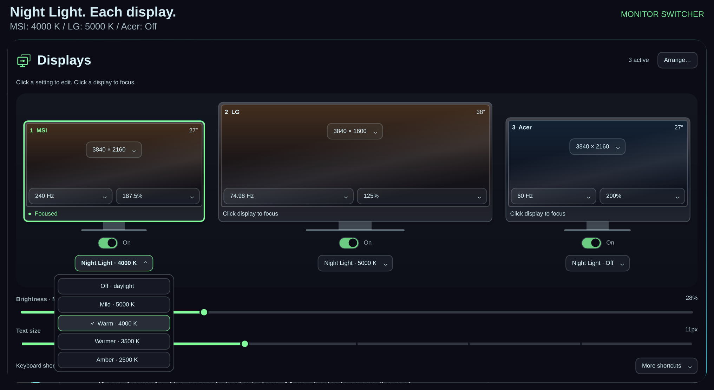

# Monitor Switcher

Your displays. One place.

Manage resolution, refresh rate, scale, power and desktop layout from one panel.


- Edit settings directly on each display and try changes with 20-second Keep/Revert.
- Drag and snap desktops together; the switcher makes room when a middle monitor returns.
- Restore the last verified working layout for your connected monitors.
- Use a gallery that adapts to screen size and scale, with readable controls.

Night Light is one of the panel's features: choose warmth separately for each
monitor, or leave selected screens in daylight. Preferences persist across
reloads and reboots.



Preview your desktop arrangement before applying it.


Power changes continue if the initiating screen turns off, and rollback verifies
the restored layout.

Update with:

```bash
omarchy plugin update case.monitor-switcher
```

Existing settings and shortcuts carry forward.

[Full changelog](CHANGELOG.md) · [Implementation and verification handoff](HANDOFF.md)
